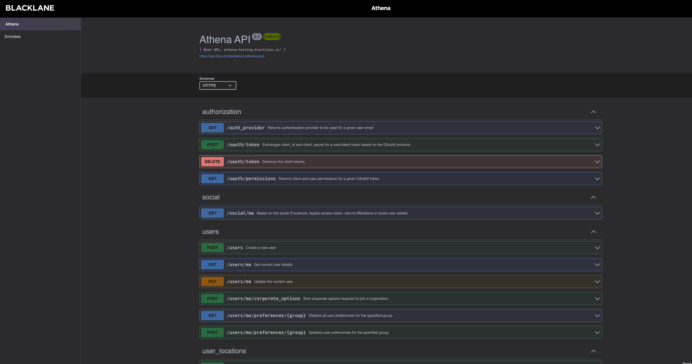

# Swagger Aggregator

A simple web application that aggregates and displays multiple Swagger/OpenAPI specifications in a single interface.

## Features

- Browse multiple API documentation in one place
- Modern, responsive UI with dark mode support
- Built with Astro, React, Tailwind CSS, and Swagger UI

## Getting Started

### Prerequisites

- Node.js (v18 or later)
- npm or bun

### Installation

```bash
# Clone the repository
git clone <repository-url>
cd swagger-aggregator

# Install dependencies
npm install
# or if using bun
bun install
```

### Running the Application

```bash
# Start the development server
npm run dev
# or
bun run dev
```

The application will be available at `http://localhost:4321` by default.

## Adding New API Specifications

To add a new API specification to the aggregator:

1. Open the root-level file `apis.config.json`
2. Add a new entry to the `apis` array following this format:

```json
{
  "name": "API Name",  // The display name for the API
  "url": "https://path/to/your/swagger.json"  // URL to the OpenAPI/Swagger JSON or YAML
}
```

Example:

```json
{
  "apis": [
    {
      "name": "Athena",
      "url": "https://api-docs.int.blacklane.io/athena.json"
    },
    {
      "name": "Emirates",
      "url": "https://api-docs.int.blacklane.io/emirates.json"
    },
    // Add your new API here
    {
      "name": "New API",
      "url": "https://example.com/api-docs.json"
    }
  ]
}
```

3. Save the file and restart the development server if needed

The new API will automatically appear in the sidebar menu.

## Building for Production

```bash
npm run build
# or
bun run build
```

The built files will be available in the `dist` directory and can be deployed to any static hosting service.

## Preview

